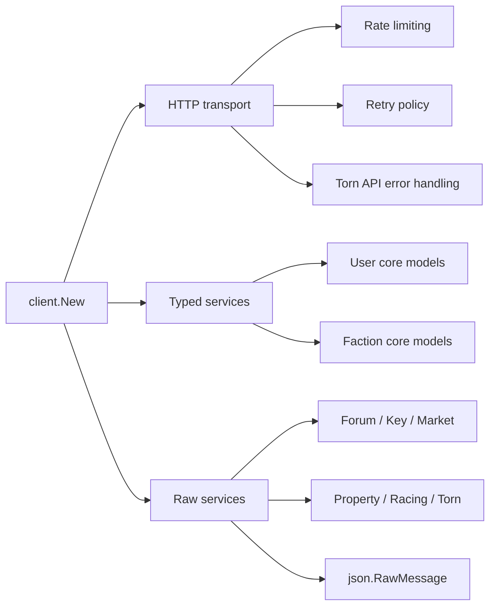

# tornSDK

[](https://github.com/subhanjanOps/tornSDK/actions/workflows/go.yml)
[](https://github.com/subhanjanOps/tornSDK/blob/master/go.mod)
[](https://pkg.go.dev/github.com/subhanjanOps/tornSDK)
[](https://github.com/subhanjanOps/tornSDK/blob/master/LICENSE)

`tornSDK` is a Go SDK for Torn API v2. It gives you a small typed layer for the most common user and faction calls, plus raw wrappers for the rest of the published `GET` surface in the current `openapi.json`.

The intent is straightforward:

- keep transport, retries, throttling, and Torn error parsing inside the SDK
- keep game logic, scoring logic, and business rules in your application
- let you choose between typed convenience and raw access when you need breadth



## What You Get

- Typed wrappers for common endpoints like user bars, user basic/profile, user battle stats, and faction basic details.
- Raw wrappers for the remaining documented `GET` endpoints across `user`, `faction`, `forum`, `key`, `market`, `property`, `racing`, and `torn`.
- Centralized retry handling for temporary failures and Torn API temporary error codes.
- Built-in request throttling with an easy off switch.
- Full unit-test coverage across the current codebase.

## Install

```bash
go get github.com/subhanjanOps/tornSDK
```

## Quick Start

This is the typed path: use it when the SDK already has a model you want.

```go
package main

import (
	"context"
	"fmt"
	"log"

	"github.com/subhanjanOps/tornSDK/client"
)

func main() {
	ctx := context.Background()

	sdk := client.New(client.Config{
		APIKey:    "YOUR_API_KEY",
		UserAgent: "my-torn-tool/1.0",
	})

	basic, err := sdk.User.GetBasic(ctx)
	if err != nil {
		log.Fatal(err)
	}

	bars, err := sdk.User.GetBars(ctx)
	if err != nil {
		log.Fatal(err)
	}

	profile, err := sdk.User.GetProfile(ctx)
	if err != nil {
		log.Fatal(err)
	}

	fmt.Printf("%s (%d) has %d/%d energy and rank %s\n",
		basic.Name,
		profile.Level,
		bars.Energy.Current,
		bars.Energy.Maximum,
		profile.Rank,
	)
}
```

This is the raw path: use it when you want the full endpoint surface without waiting for a typed model.

```go
package main

import (
	"context"
	"encoding/json"
	"log"
	"net/url"

	"github.com/subhanjanOps/tornSDK/client"
)

func main() {
	ctx := context.Background()

	sdk := client.New(client.Config{
		APIKey:    "YOUR_API_KEY",
		UserAgent: "my-torn-tool/1.0",
	})

	query := url.Values{
		"comment": {"my-torn-tool"},
	}

	raw, err := sdk.Torn.GetTornLookup(ctx, query)
	if err != nil {
		log.Fatal(err)
	}

	var lookup struct {
		Selections []string `json:"selections"`
	}

	if err := json.Unmarshal(raw, &lookup); err != nil {
		log.Fatal(err)
	}

	log.Printf("torn lookup returned %d selections", len(lookup.Selections))
}
```

## Package Map

| Package | Style | Notes |
| --- | --- | --- |
| `client` | Core | Entry point, config, retry policy, limiter, and Torn/HTTP error handling |
| `user` | Typed + raw | Typed core user endpoints plus raw wrappers for the rest of the user `GET` surface |
| `faction` | Typed + raw | Typed faction basic endpoints plus raw wrappers for the rest of the faction `GET` surface |
| `forum` | Raw | Forum endpoint wrappers returning `json.RawMessage` |
| `key` | Raw | Key endpoint wrappers returning `json.RawMessage` |
| `market` | Raw | Market endpoint wrappers returning `json.RawMessage` |
| `property` | Raw | Property endpoint wrappers returning `json.RawMessage` |
| `racing` | Raw | Racing endpoint wrappers returning `json.RawMessage` |
| `torn` | Raw | Torn endpoint wrappers returning `json.RawMessage` |

## Typed vs Raw

Use typed methods when:

- you call the same endpoint regularly
- a stable Go struct makes downstream code cleaner
- you want field-level IDE help and compile-time checking

Use raw methods when:

- you need broad coverage fast
- the endpoint response is large or evolving
- you want to own the final JSON decoding in your application

Raw wrappers all follow the same shape:

- input: `context.Context`
- input: any path params as `string`
- input: `url.Values` for query parameters
- output: `json.RawMessage`

## Configuration

`client.Config` supports:

- `APIKey`
- `BaseURL`
- `HTTPClient`
- `UserAgent`
- `RequestsPerMinute`
- `MaxRetries`
- `RetryWaitMin`
- `RetryWaitMax`

Default behavior:

- Base URL: `https://api.torn.com/v2`
- Timeout: `15s`
- Rate limit: `100` requests per minute
- Retries: `2` retries with exponential backoff from `1s` to `5s`

Operational notes:

- The SDK currently sends the API key through the `key` query parameter.
- Torn recommends setting a custom `User-Agent`; you should set `Config.UserAgent` for production use.
- Set `RequestsPerMinute` to a negative value to disable SDK throttling.
- Set `MaxRetries` to a negative value to disable retries.

## Error Handling

The client distinguishes between:

- Torn API errors returned in JSON
- non-2xx HTTP responses
- network and timeout failures

Temporary errors are retried according to the configured retry policy. Non-temporary errors are returned directly.

## Development

Useful local commands:

```bash
go test ./...
go vet ./...
go build ./...
go test ./... -coverprofile=coverage.out
go tool cover -html=coverage.out -o coverage.html
```

The wrapper surface can be regenerated from the local spec with:

```bash
python tools/generate_wrappers.py
```

## Project Scope

This SDK focuses on transport and endpoint access. It does not try to provide:

- Torn game strategy
- domain-specific analytics
- opinionated caching
- custom business rules on top of Torn data

That separation is intentional so the SDK stays predictable and easy to compose.

## Maintainers

- [Subhanjan Adhikary](https://github.com/subhanjanOps) — creator and primary maintainer

## Contributors

Thanks to everyone who has contributed to this project!

<a href="https://github.com/subhanjanOps/tornSDK/graphs/contributors">
  
</a>

Contributions are welcome! Please open an issue or submit a pull request.
